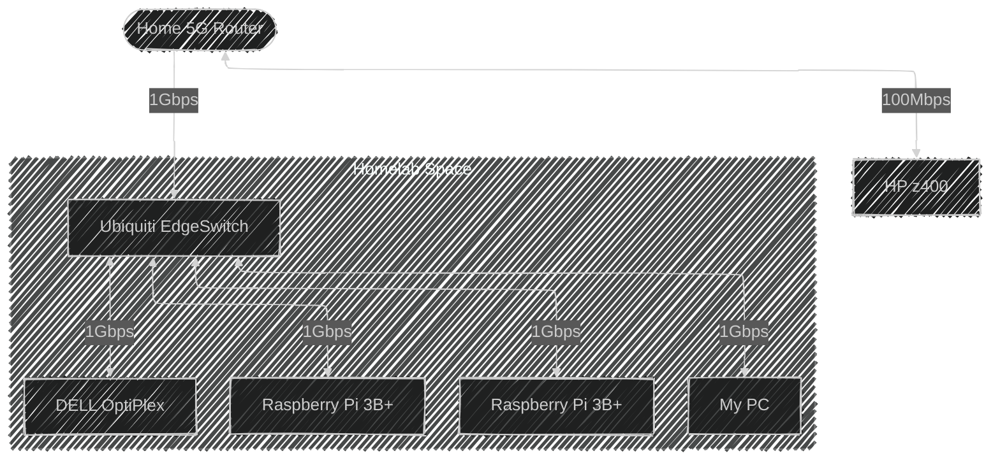

### Current Hardware 🧑‍💻
* (1) Raspberry Pi 3B+ - 1Gbps link ● Running Docker
  * Portainer - Docker management UI
  * Tailscale - VPN to connect to it remotely
  * Nginx - Web server
  * Uptime Kuma - WebUI monitoring panel
  <br />

* (2) Raspberry Pi 3B+ - 1Gbps link ● Running Docker
    * Portainer - Docker management UI
    * Tailscale - VPN to connect to it remotely
```(2) Used for testing and development right now, will be used for remote desktop access to my homelab in the future.```

<br />

* Old HP z400 Xeon desktop - 100Mbps link, local only ● Running CasaOS
    * Crafty - Minecraft server manager
    * Portainer - Docker management UI
    * Nexcloud - Cloud storage (8tb)
``` Used to run local minecraft server and some other things. Will be replaced with a new server in the future. (It eats a lot of power)```

<br />

#### Networking Hardware
* (1) Ubiquiti EdgeSwitch ES-8-150W - 8 port gigabit managed switch with PoE support.
    * My main switch for only the homelab, since no one else needs lan connectivity.
    * I've got it for $13 from our goverment auction soo, it was a steal.

<br />

* (1) DELL OptiPlex USFF 7010 - 1Gbps link ● Running pfSense
    * pfSense - Firewall and router software
    * Tailscale - VPN to connect to it remotely
``` Used for CG-NAT bypass with VPN to forward ports to my VPS. Also as a firewall. ```


### How it's all connected 🔌


# Continuing in few hours...